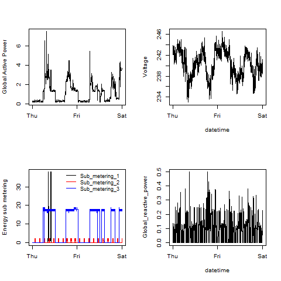

## Introduction

This assignment uses data from
the <a href="http://archive.ics.uci.edu/ml/">UC Irvine Machine
Learning Repository</a>, a popular repository for machine learning
datasets. In particular, we will be using the "Individual household
electric power consumption Data Set" which I have made available on
the course web site:


* <b>Dataset</b>: <a href="https://d396qusza40orc.cloudfront.net/exdata%2Fdata%2Fhousehold_power_consumption.zip">Electric power consumption</a> [20Mb]

* <b>Description</b>: Measurements of electric power consumption in
one household with a one-minute sampling rate over a period of almost
4 years. Different electrical quantities and some sub-metering values
are available.


The following descriptions of the 9 variables in the dataset are taken
from
the <a href="https://archive.ics.uci.edu/ml/datasets/Individual+household+electric+power+consumption">UCI
web site</a>:

<ol>
<li><b>Date</b>: Date in format dd/mm/yyyy </li>
<li><b>Time</b>: time in format hh:mm:ss </li>
<li><b>Global_active_power</b>: household global minute-averaged active power (in kilowatt) </li>
<li><b>Global_reactive_power</b>: household global minute-averaged reactive power (in kilowatt) </li>
<li><b>Voltage</b>: minute-averaged voltage (in volt) </li>
<li><b>Global_intensity</b>: household global minute-averaged current intensity (in ampere) </li>
<li><b>Sub_metering_1</b>: energy sub-metering No. 1 (in watt-hour of active energy). It corresponds to the kitchen, containing mainly a dishwasher, an oven and a microwave (hot plates are not electric but gas powered). </li>
<li><b>Sub_metering_2</b>: energy sub-metering No. 2 (in watt-hour of active energy). It corresponds to the laundry room, containing a washing-machine, a tumble-drier, a refrigerator and a light. </li>
<li><b>Sub_metering_3</b>: energy sub-metering No. 3 (in watt-hour of active energy). It corresponds to an electric water-heater and an air-conditioner.</li>
</ol>

## Loading the data


When loading the dataset into R, please consider the following:

* The dataset has 2,075,259 rows and 9 columns. First
calculate a rough estimate of how much memory the dataset will require
in memory before reading into R. Make sure your computer has enough
memory (most modern computers should be fine).

* We will only be using data from the dates 2007-02-01 and
2007-02-02. One alternative is to read the data from just those dates
rather than reading in the entire dataset and subsetting to those
dates.

* You may find it useful to convert the Date and Time variables to
Date/Time classes in R using the `strptime()` and `as.Date()`
functions.

* Note that in this dataset missing values are coded as `?`.


## Making Plots

Our overall goal here is simply to examine how household energy usage
varies over a 2-day period in February, 2007.

R script code with corresponding png file can be found here

# plot1.R 

```R
library(data.table)
# reading the the data 
# as na are marked as ? , mentioning it as na. 
global_power = data.table::fread(input = "household_power_consumption.txt"
                                 ,na.strings = "?")

# To prevent scientific Notations in Y axis 
global_power[, Global_active_power := lapply(.SD, as.numeric)
             ,.SDcols = c("Global_active_power")]

# Change Date Column to Date Type
global_power[, Date := lapply(.SD, as.Date, "%d/%m/%Y")
             , .SDcols = c("Date")]

# Filter Dates for 2007-02-01 and 2007-02-02

global_power<- global_power[(Date >= "2007-02-01") & (Date <= "2007-02-02")]

png("plot1.png", width=480, height=480) # opening connection for png 

## Plot 1
hist(global_power[, Global_active_power], main="Global Active Power", 
     xlab="Global Active Power (kilowatts)", ylab="Frequency", col="Red")

dev.off() # close the connection
```

### Plot 1


 

# plot2.R 

```R
library("data.table")

#Reads the data 
power_consumption <- data.table::fread(input = "household_power_consumption.txt"
                             , na.strings="?"
)

# Prevents Scientific Notation in Y axis 
power_consumption[, Global_active_power := lapply(.SD, as.numeric), .SDcols = c("Global_active_power")]

# converting string into datetime format
power_consumption[, dateTime := as.POSIXct(paste(Date, Time), format = "%d/%m/%Y %H:%M:%S")]

# Filter Dates for 2007-02-01 and 2007-02-02
power_consumption <- power_consumption[(dateTime >= "2007-02-01") & (dateTime < "2007-02-03")]

png("plot2.png", width=480, height=480) # opening png connection

## Plot 2
plot(x = power_consumption[, dateTime]
     , y = power_consumption[, Global_active_power]
     , type="l", xlab="", ylab="Global Active Power (kilowatts)")

dev.off() #closing the connection
```

### Plot 2

 

# plot3.R 

```R
library("data.table")

#Reads the data 
power_consumption <- data.table::fread(input = "household_power_consumption.txt"
                                       , na.strings="?"
)

# Prevents Scientific Notation in Y axis 
power_consumption[, Global_active_power := lapply(.SD, as.numeric), .SDcols = c("Global_active_power")]

# converting string into datetime format
power_consumption[, dateTime := as.POSIXct(paste(Date, Time), format = "%d/%m/%Y %H:%M:%S")]

# Filter Dates for 2007-02-01 and 2007-02-02
power_consumption <- power_consumption[(dateTime >= "2007-02-01") & (dateTime < "2007-02-03")]

png("plot3.png", width=480, height=480) # opening png connection

# plot 3
plot(power_consumption[,dateTime],power_consumption[,Sub_metering_1],type='l',xlab="",ylab="Energy sub metering")
lines(power_consumption[,dateTime],power_consumption[,Sub_metering_2],col="red")
lines(power_consumption[,dateTime],power_consumption[,Sub_metering_3],col="blue")
legend("topright",col = c("black","red","blue"),c("Sub_metering_1","Sub_metering_2","Sub_metering_3"),lty =c(1,1),lwd = c(1,1))

dev.off() # closing the connection 
```

### Plot 3

 

# plot4.R 

```R
library("data.table")

#Reads the data 
power_consumption <- data.table::fread(input = "household_power_consumption.txt"
                                       , na.strings="?"
)

# Prevents Scientific Notation in Y axis 
power_consumption[, Global_active_power := lapply(.SD, as.numeric), .SDcols = c("Global_active_power")]

# converting string into datetime format
power_consumption[, dateTime := as.POSIXct(paste(Date, Time), format = "%d/%m/%Y %H:%M:%S")]

# Filter Dates for 2007-02-01 and 2007-02-02
power_consumption <- power_consumption[(dateTime >= "2007-02-01") & (dateTime < "2007-02-03")]

png("plot4.png", width=480, height=480) # opening png connection

par(mfrow=c(2,2)) # creating space of 2*2 matrix for storing subplots

# sub plot 1
plot(power_consumption[, dateTime], power_consumption[, Global_active_power], type="l", xlab="", ylab="Global Active Power")
# sub Plot 2
plot(power_consumption[, dateTime],power_consumption[, Voltage], type="l", xlab="datetime", ylab="Voltage")

# sub Plot 3
plot(power_consumption[, dateTime], power_consumption[, Sub_metering_1], type="l", xlab="", ylab="Energy sub metering")
lines(power_consumption[, dateTime], power_consumption[, Sub_metering_2], col="red")
lines(power_consumption[, dateTime], power_consumption[, Sub_metering_3],col="blue")
legend("topright", col=c("black","red","blue")
       , c("Sub_metering_1  ","Sub_metering_2  ", "Sub_metering_3  ")
       , lty=c(1,1)
       , bty="n"
       , cex=.9) 

# sub plot 4
plot(power_consumption[, dateTime], power_consumption[,Global_reactive_power], type="l", xlab="datetime", ylab="Global_reactive_power")

dev.off() # closing off the connection
```

### Plot 4

 

